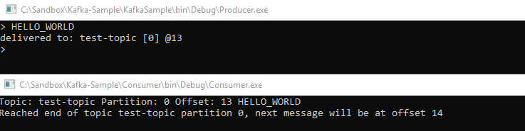

## Adresler
Kafka Manager UI: `localhost:9001`

Kafka Service Address: `localhost:9092`

## Önemli
Consumer uygulaması ilk açıldığında `Error: 84375d4a6909:9092/0: Failed to resolve '84375d4a6909:9092': No such host is known.` şeklinde hata alınabilir. 
Burada kafkanın host ayarlarının default olarak tanımlanmasından kaynaklanan bir durum söz konusu. Dev ortamında host ip ile bağlansak dahi 
host adresini alıp devam ediyor. Hosts dosyasına `127.0.0.1 84375d4a6909` şeklinde kayıt eklenmesi sorunu çözecektir. 

(Production ortamında host adresleri docker-compose üzerinden uygulama configurasyonuna tanımlanabildiği için doğru configure edilmesi durumunda sorun oluşmaz)

